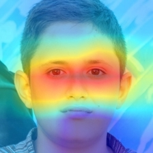
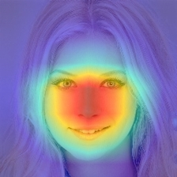

# 🧠 Real vs AI Face Classifier

🔗 **Live Demo:** [real-vs-ai-face-classifier.onrender.com](https://real-vs-ai-face-classifier.onrender.com)  
🕒 **Note:** This app is hosted on Render’s free tier.  
It may take 20–30 seconds to wake up on first visit due to cold start.

Deep-learning pipeline that distinguishes **real human faces** from **AI-generated (GAN) faces**.

* ResNet-18 backbone + 2-unit head  
* Grad-CAM visual explanations  
* Temperature-scaled confidence ( *T ≈ 1.7 )  
* Streamlit demo UI  
* One-command Docker deployment  

---

## 📑 Table of Contents
1. [Folder Structure](#-folder-structure)
2. [Model Overview](#-model-overview)
3. [Limitation: No Face Detection](#-limitation-no-face-detection)
3. [Performance](#-performance)
4. [Example Grad-CAM](#️-example-grad-cam)
5. [Quick Start](#-quick-start)
6. [Training](#-training)
6. [Notebooks](#-notebooks)  
7. [Environment](#-environment)  
8. [License](#-license)  

---

## 📂 Folder Structure
```txt
real-vs-ai-face-classifier/
├── app.py                    # Streamlit web app
├── Dockerfile                # Container recipe
├── models/
│   ├── best_model_finetuned.pth
│   └── best_temperature.pt
├── src/
│   ├── model.py
│   ├── gradcam.py
│   ├── train.py
│   └── …
├── notebooks/
│   ├── 01-data-exploration.ipynb
│   ├── 02-gradcam-demo.ipynb
│   └── 03-temperature-scaling.ipynb
├── requirements.txt
└── .gitignore
````

---

## 🧠 Model Overview

| Item             | Details                              |
| ---------------- | ------------------------------------ |
| Backbone         | ResNet-18 (ImageNet weights)         |
| Head             | `AdaptiveAvgPool2d → FC(512, 2)`     |
| Loss / Optimizer | Cross-entropy / Adam (1 e-4)         |
| Training data    | ≈ 380 k faces (Real + StyleGAN/DDPM) |
| Temperature T    | **1.7** (learned on validation set)  |
---

## ⚠️ Limitation: No Face Detection

This model is a **binary classifier** trained to distinguish between **real** and **AI-generated** *face images*. It **does not verify** whether the input image actually contains a face.

As a result, when uploading **non-face images** (e.g. landscapes, screenshots, objects), the model may still output a prediction like “Real — 72%”, because it’s forced to choose between two classes.

➡️ **Tip:** For best results, upload a clear, frontal face photo.
A future update may include automatic face detection to prevent misclassification on irrelevant inputs.

---


## 📈 Performance

| Dataset / Metric           | Accuracy   |
| -------------------------- | ---------- |
| Standard test split        | **99.2 %** |
| Fine-tuned (hard-real) set | 90.0 %     |
| OOD AI (500)               | 88 %       |
| OOD Real (500)             | 85 %       |

---

## 🖼️ Example Grad-CAM

| Real Face                                        | AI-Generated                                     |
| ------------------------------------------------ | ------------------------------------------------ |
|  |  |

---

## 🚀 Quick Start

### 1 · Clone the repo

```bash
git clone https://github.com/logvisionn/real-vs-ai-face-classifier.git
cd real-vs-ai-face-classifier
```

### 2 · Run locally (Conda)

```bash
conda env create -f environment.yml
conda activate face-classifier
streamlit run app.py
```

### 3 · Run with Docker

```bash
docker build -t face-classifier .
docker run -p 8501:8501 face-classifier
# open http://localhost:8501
```

📌 Update weights live (no rebuild):

```bash
docker run -p 8501:8501 -v %cd%/models:/app/models face-classifier
```

---
## 🏋️ Training

1. Place your raw datasets under `data/raw/real/` and `data/raw/ai/`.
2. Preprocess and split them into train/val/test:

```bash
python src/data_preprocessing.py --real-raw data/raw/real --ai-raw data/raw/ai --processed-dir data/processed
```

3. Train the classifier (saves `best_model.pth` under `models/`):

```bash
python src/train.py --data-dir data/processed --output-dir models
```

4. Evaluate a saved model:

```bash
python src/train.py --evaluate-only --data-dir data/processed --output-dir models
```

Optional fine‑tuning on the hard‑real set:

```bash
python src/finetune_hard_real.py --data-dir data/hard_finetune --model-path models/best_model.pth --output-path models/best_model_finetuned.pth
```


---

## 🔬 Notebooks

| Notebook                   | Purpose                                           |
| -------------------------- | ------------------------------------------------- |
| **01-data-exploration**    | Sample images, class distribution                 |
| **02-gradcam-demo**        | Grad-CAM on mis/correct & OOD faces               |
| **03-temperature-scaling** | Learns scalar *T* and saves `best_temperature.pt` |

---

## 📦 Environment

Key packages (full list in `requirements.txt` / `environment.yml`):

* `torch >= 2.0`  ·  `torchvision`  ·  `captum`
* `opencv-python-headless`  ·  `streamlit`  ·  `scikit-learn`

---

## © License

MIT — free for personal and commercial use with attribution.

